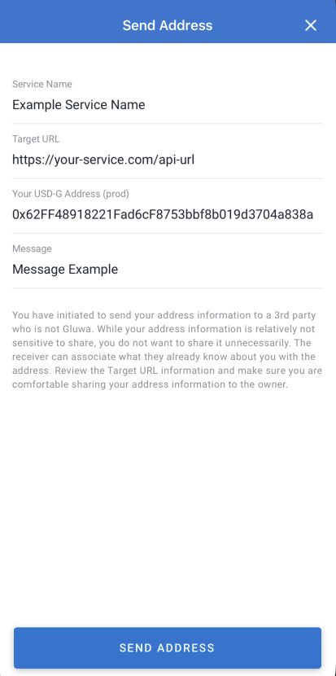

# Sending Address

## About Send Address

In this section, you will learn how to get Gluwacoin address or Bitcoin address from a user to your server.

**The Steps of Send Address**

1. Create a QR code meeting the send address standard.
2. A user scans the QR Code with the camera inside Gluwa mobile app.
3. The app sends the address as a web request to the API URL defined within the QR code.
4. The API may make a respond and tell the user the address was successfully received.

### Creating a QR Code for Send Address

In this section, we describe what information you need to include in the QR Code to receive address information from the user.

#### QR Code Example


#### QR Code Parameters

| Key | Required | Description |
| :--- | :---: | :--- |
| QrType | `true` | This value must be `SendAddress` . |
| Key | `true` | A key to identify the user. You can set any value that fits your requirements. |
| Message | `false` | A message shown in the send address preview screen. If there is any information the user must know, you can put it in this field. |
| ServiceName | `true` | The service name shown in the send address preview screen. |
| TargetUrl | `true` | The API URL where you will receive the address. Shown in the send address preview screen. |
| Currency | `true` | Set the currency of the address you want to receive. `USDG` `KRWG` `BTC` |
| Environment | `true` | Set the environment of the address you want to receive. `prod` `sandbox` |

### Scanning the Send Address QR Code

Once the user scans the send address QR code, the user will get redirected to a send address preview screen. There, the user can either confirm to send his address by pressing `SEND ADDRESS` button on the bottom or cancel the process by pressing the cancel icon on the upper right corner.



### Sending the Address

Once the user confirms the information on the send address preview screen and press the `SEND ADDRESS` button, the mobile app makes a `POST` http request with the address information. The app encodes `Key` value and `Address` as JSON and include it in the request body. The request is sent to the target URL as defined in the `TargetUrl`.

#### `POST` Request

```text
{
    "Key": "as defined in the Send Address QR Code",
    "Address": "Address of the user"
}
```

### Response

After receiving the Address information, you can send the result as a response message to the user.

| Key | Required | Description |
| :--- | :---: | ---: |
| Code | `true` | `200` `201` |
| Message | `false` | `String` |

